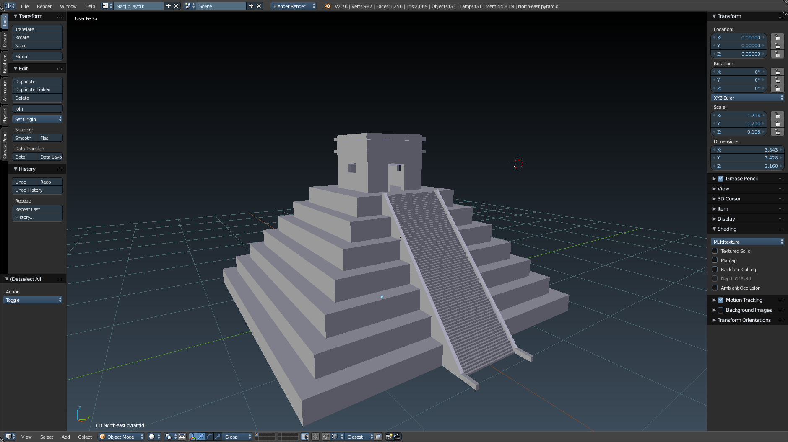

# Blender models

[Learning Blender with Udemy](https://www.udemy.com/blendertutorial/) and publishing my models in this public repository.

## Screenshots

## Copyright

### No copyright on the .blend files

Feel free to copy and re-use the .blend files I made for any purpose, with or without attribution.

### Various copyright on the assets

The non .blend files may be copyright. I found these on Google Images and the Udemy course I followed, so their presence in this repository doesn't give you any rights on them. If you want to use them, you should chase down where they are from and whether it's possible to use them. Let me know if you do: hello@ebabel.eu

