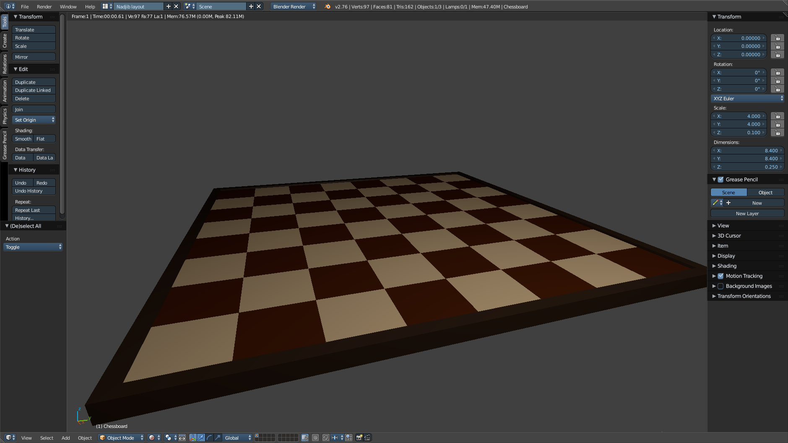

# Chess

## Scaling

| Object | Real size | Ratio | Blender units |
| --- | --- | --- | --- |
| king (height) | 9.5 cm | 5:1 | 4.75 |
| king (base diameter) | 4.5 cm | 5:1 | 2.25 |
| single chessboard square (diameter) | 6 cm | 5:1 | 0.3 |
| chessboard, no edge (diameter) | 48 cm | 5:1 | ? |
| queen, rooks, bishops and knights (base diameter) | 4 cm | 5:1 | ? |
| pawns | 3 cm | 5:1 | ? |

## Screenshot

