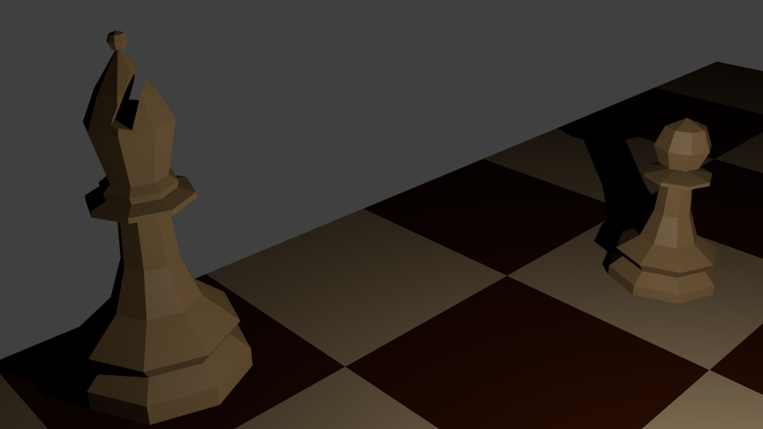

# Chess

## Scaling

| Object | Real size | Ratio | Blender units |
| --- | --- | --- | --- |
| king (height) | 9.5 cm | 1:1 | 9.5 |
| king (base diameter) | 4.5 cm | 1:1 | 4.5 |
| single chessboard square (diameter) | 6 cm | 1:1 | 6 |
| chessboard, no edge (diameter) | 48 cm | 1:1 | 48 |
| queen, rooks, bishops and knights (base diameter) | 4 cm | 1:1 | 4 |
| pawns | 3 cm | 1:1 | 3 |

## Screenshots

